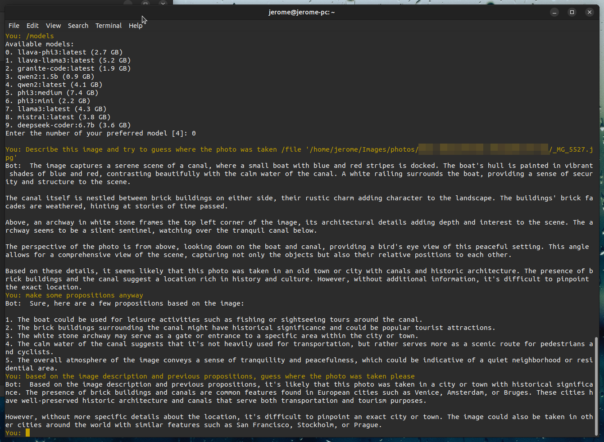
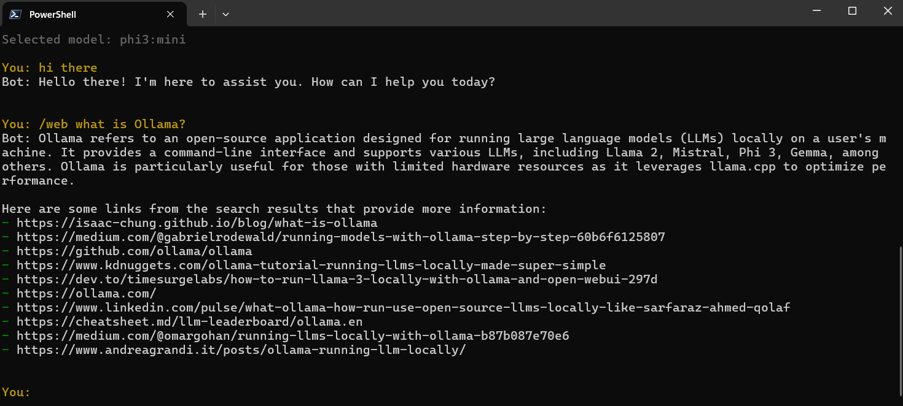

# Ollama-Chat: Extensible CLI for Local Language Models and OpenAI Models

**Ollama-Chat** is a powerful, customizable Python CLI tool that interacts with local Language Models (LLMs) via `Ollama` and `Llama-Cpp` servers, as well as OpenAI models. Designed with flexibility and **privacy** in mind, this tool ensures that all LLMs run locally on your machine, meaning your data never leaves your environment. It also integrates seamlessly with a local or distant `ChromaDB` vector database, providing efficient Retrieval-Augmented Generation (RAG) capabilities to enhance response accuracy.

**Extensibility**: you can build and integrate your own plugins, tailoring the tool to your specific workflows and creative projects.

## Key Features
- **Local and Private LLM Integration:** Interact with local LLMs through `Ollama` and `Llama-Cpp` for high-performance AI without sacrificing privacy—your data stays on your machine.
- **RAG Support:** Harness Retrieval-Augmented Generation (RAG) with ChromaDB to provide more contextually relevant answers by integrating vectorized data.
  - **Command-Line RAG Operations:** Full support for document indexing and querying from the command line. See [RAG CLI Usage Guide](RAG_CLI_USAGE.md) for details.
  - **Advanced Chunking:** Smart document chunking with configurable strategies
  - **Selective Indexing:** Extract and index specific document sections
  - **Auto-Summarization:** Generate and prepend AI summaries to chunks for better retrieval
- **Custom Plugins:** Easily add custom plugins that extend the model's capabilities, making the tool adaptable to your personal or team workflows.
- **Web Search:** Use the `/web` command or web_search tool to search the web, chunk articles, and store them in ChromaDB for generating insightful answers.
- **Conversation Memory:** Remembering topics discussed across all chats saves you from having to repeat information and makes future conversations more helpful.

## Why Ollama-Chat?
Ollama-Chat is more than just another AI interface—it's a privacy-first, customizable platform built for developers who want full control over their LLM interactions. Whether you're developing new workflows, refining business strategies, or exploring creative projects, Ollama-Chat makes it easy to add custom logic and behaviors, ensuring the tool works exactly as you need it to—all while keeping your data secure.

## Extensible Plugin System
The plugin system allows you to enhance and personalize Ollama-Chat by adding new commands, actions, and behaviors based on user input. Whether it's generating new ideas, analyzing content, or retrieving additional resources, the possibilities are limitless.

### Quickstart: Writing a Plugin

Creating a plugin for Ollama-Chat is simple, and you can personalize how the LLM interacts with users by integrating custom chatbot personalities. Plugins can listen to user input, interact with these personalities, and respond with custom logic. Here’s an example of a **Idea Generator** plugin:

```python
class IdeaGeneratorPlugin():
    def on_user_input_done(self, user_input, verbose_mode=False):
        if user_input and "/idea" in user_input:
            idea = user_input.replace("/idea", "").strip()
            return (f"I have the following idea: '{idea}'. Please generate a list of questions "
                    "that will help me refine this idea, one question at a time. Focus on aspects "
                    "like clarity, feasibility, potential challenges, resources needed, and how it "
                    "could be improved or expanded. The questions should guide me through thinking "
                    "more deeply about how to implement or improve the idea.")
        
        if user_input and "/search" in user_input:
            idea = user_input.replace("/search", "").strip()
            return (f"I have chosen the following question to explore further: '{idea}'. Please "
                    "generate a web search query that includes the context of the question and "
                    "focuses on gathering relevant information or resources to help me find "
                    "answers or solutions.")
        
        return None
```

#### Personalizing the LLM System Prompt
In this example, you can further enhance the experience by defining a custom chatbot personality through a system prompt. For instance, the **Idea Generator** plugin could use the following prompt:

```
You are an idea-generating assistant. The user will provide a subject or a topic, and your task is to suggest a variety of creative, practical, or innovative ideas related to that subject. You should:

- Provide a range of ideas that span from common solutions to more out-of-the-box thinking.
- Ensure the ideas are useful and tailored to the specific subject given.
- Offer a balance of simplicity and complexity, so users with different needs can find value.
- Feel free to suggest actionable steps, project ideas, or thought-provoking concepts.
- Avoid overly technical jargon unless the subject specifically calls for it.

Be clear, concise, and aim to inspire creativity!
```

This system prompt defines the assistant’s personality and behavior, ensuring that the responses are tailored to generating and refining creative ideas. For more details on how to implement and customize system prompts, refer to the [#how-to-specify-custom-chatbot-personalities-in-json-format](#how-to-specify-custom-chatbot-personalities-in-json-format) section in the README.

By combining custom plugins and personalized system prompts, Ollama-Chat provides full control over how the LLM interacts, allowing it to meet the specific needs of any user or project.

### How It Works
1. **User Input**: When the user enters a command like `/idea`, the plugin detects it and processes the input.
2. **Response**: The plugin responds by generating helpful questions or search queries to guide further exploration.
3. **Customization**: You can modify this plugin or create new ones that suit your specific needs, from automating workflows to integrating with external APIs.

## Web Search Feature
Ollama-Chat comes with a built-in feature that allows you to search the web using the `/web` command or web_search tool. The tool retrieves relevant articles from the web, chunks them into manageable pieces, and stores them in the ChromaDB vector database. This allows Ollama-Chat to generate more informed and contextually rich answers, blending local and web-based knowledge.

### Example Workflow:
1. **Web Search**: User types `/web What are the latest trends in AI?`.
2. **Chunking**: Articles retrieved from the web are split into meaningful chunks.
3. **Storage**: These chunks are stored in ChromaDB.
4. **Response**: The model can now use this stored data to provide an informed answer, with additional context retrieved from the web.

## Installation
1. Clone the repository:
   ```bash
   git clone https://github.com/jeromeboivin/ollama-chat
   cd ollama-chat
   ```

2. Install dependencies:
   ```bash
   pip install -r requirements.txt
   ```

3. Start the Ollama or Llama-Cpp server, then run the CLI:
   ```bash
   python ollama_chat.py
   ```

4. Start customizing by writing your own plugins!

## Quick Start: RAG Operations

### Index Documents from Command Line
```bash
# Basic indexing
python ollama_chat.py --index-documents /path/to/docs --collection my_docs --embeddings-model mxbai-embed-large --interactive=False

# Advanced indexing with options
python ollama_chat.py \
  --index-documents /path/to/docs \
  --collection my_docs \
  --embeddings-model mxbai-embed-large \
  --chunk-documents \
  --split-paragraphs \
  --add-summary \
  --verbose \
  --interactive=False
```

### Query Documents from Command Line
```bash
# Basic query
python ollama_chat.py --query "What is the main concept?" --collection my_docs --embeddings-model mxbai-embed-large --interactive=False

# Query with custom options
python ollama_chat.py \
  --query "What is the main concept?" \
  --collection my_docs \
  --embeddings-model mxbai-embed-large \
  --query-n-results 10 \
  --query-distance-threshold 0.5 \
  --output results.txt \
  --interactive=False
```

### Combined Operations
```bash
# Index and then query in one command
python ollama_chat.py \
  --index-documents /path/to/docs \
  --query "What is the main concept?" \
  --collection my_docs \
  --embeddings-model mxbai-embed-large \
  --interactive=False
```

**For complete RAG documentation**, including all parameters, advanced features, and examples, see the [RAG CLI Usage Guide](RAG_CLI_USAGE.md).

## How to Use the Ollama Chatbot Script

This guide will explain how to use the `ollama_chat.py` script. This script is designed to act as a terminal-based user interface for Ollama and it accepts several command-line arguments to customize its behavior.

Here's a step-by-step guide on how to use it:

1. **Run the script**: You can run the script using Python. The command to run the script is `python ollama_chat.py`. This will run the script with all default settings.

2. **Specify ChromaDB database path**: If you want to specify the ChromaDB database folder path, you can use the `--chroma-path` argument followed by the path to your database folder. For example: `python ollama_chat.py --chroma-path /path/to/chroma`.

3. **Specify ChromaDB client host and port**: If you want to specify the ChromaDB client host and port, you can use the `--chroma-host` and `--chroma-port` arguments. For example, `python ollama_chat.py --chroma-host myhost --chroma-port 1234`.

4. **Specify the ChromaDB collection name**: Use the `--collection` argument to specify the ChromaDB collection name. For example, `python ollama_chat.py --collection mycollection`.

5. **Use Ollama or OpenAI API (Llama-CPP)**: By default, the script uses Ollama. If you want to use the OpenAI API, use the `--use-openai` argument. For example, `python ollama_chat.py --use-openai`.

6. **Set the temperature for the model**: You can set the temperature using the `--temperature` argument. For example, `python ollama_chat.py --temperature 0.8`.

7. **Disable the system role**: If the selected model does not support the system role, like Google Gemma models, use the `--disable-system-role` argument. For example, `python ollama_chat.py --disable-system-role`.

8. **Specify the prompt template for Llama-CPP**: Use the `--prompt-template` argument to specify the prompt template for Llama-CPP. For example, `python ollama_chat.py --prompt-template "ChatML"`.

9. **Specify the path to a JSON file containing additional chatbots**: Use the `--additional-chatbots` argument to specify the path to a JSON file containing additional chatbots. For example, `python ollama_chat.py --additional-chatbots /path/to/chatbots.json`.

10. **Enable verbose mode**: If you want to enable verbose mode, use the `--verbose` argument. For example, `python ollama_chat.py --verbose`.

11. **Specify the Ollama sentence embeddings model**: Use the `--embeddings-model` argument to specify the sentence embeddings model to use for vector database queries. For example, `python ollama_chat.py --embeddings-model mxbai-embed-large`.

12. **Specify a system prompt message**: Use the `--system-prompt` argument to specify a system prompt message. For example, `python ollama_chat.py --system-prompt "You are a teacher teaching physics, you must not give the answers but ask questions to guide the student in order to find the answer."`.

13. **Specify the Ollama model to use**: Use the `--model` argument to specify the Ollama model to be used. Default model: `phi3:mini`.

14. **Specify the folder to save conversations to**: Use the `--conversations-folder <folder-path>` to specify the folder to save conversations to. If not specified, conversations will be saved in the current directory.

15. **Save the conversation automatically**: Use the `--auto-save` argument to automatically saves the conversation when exiting the program.

16. **Index a local folder to the current ChromaDB collection**: Use the `--index-documents` to specify the root folder containing text files to index.
    - **Advanced indexing options** (see [RAG CLI Usage Guide](RAG_CLI_USAGE.md) for details):
      - `--chunk-documents`: Enable/disable document chunking (default: enabled)
      - `--skip-existing`: Skip documents already in collection (default: enabled)
      - `--extract-start <text>`: Start marker for extracting specific document sections
      - `--extract-end <text>`: End marker for extracting specific document sections
      - `--split-paragraphs`: Split Markdown content into paragraphs
      - `--add-summary`: Generate and prepend AI summaries to chunks (default: enabled)

17. **Query the vector database**: Use `--query "<your question>"` to query indexed documents from the command line.
    - **Query options**:
      - `--query-n-results <number>`: Number of results to return (default: 8)
      - `--query-distance-threshold <float>`: Distance threshold for filtering results (default: 0.0)
      - `--expand-query`: Enable/disable query expansion for better retrieval (default: enabled)
      - `--output <file>`: Save query results to a file

18. **Deactivate conversation memory**: Use the `--no-memory` argument to deactivate memory management.

19. **Change default Ollama context window length**: Use the `--context-window <window length>` to increase or decrease Ollama context window length. If not specified, the default value is used, which is 2048 tokens.

20. **Start the conversation automatically**: Use the `--auto-start` argument to start the conversation immediately without requiring user input.

21. **Specify the memory collection name**: Use the `--memory-collection-name <collection name>` argument to specify the name of the memory collection to use for context management. If not specified, the default value is used.

22. **Specify the long-term memory file**: Use the `--long-term-memory-file <file name>` argument to specify the long-term memory file name. If not specified, the default value is used.

23. **List available tools**: Use `--list-tools` to display all available tools (both built-in and plugin tools) with their descriptions and parameters, then exit. Useful for discovering what tools are available.
    ```bash
    python ollama_chat.py --list-tools
    ```

24. **List ChromaDB collections**: Use `--list-collections` to display all existing ChromaDB collections with their metadata and document counts, then exit. Useful for discovering what vector database collections are available.
    ```bash
    # List collections using default settings (localhost:8000)
    python ollama_chat.py --list-collections
    
    # List collections with custom ChromaDB connection
    python ollama_chat.py --list-collections --chroma-host myhost --chroma-port 9000
    
    # List collections from a local database path
    python ollama_chat.py --list-collections --chroma-path /path/to/db
    
    # With verbose mode for debugging
    python ollama_chat.py --list-collections --verbose
    ```

Remember, all these arguments are optional. If you don't specify them, the script will use the default values.

### Multiline input

For multiline input, you can wrap text with `"""`:

```
You: """Hello,
... world!
... """
```

## How to Use Special Switches

The Ollama client supports several special switches to enhance your interaction with the chatbot. Here's a brief guide on how to use them:

1. `/file <path of a file to load>`: This command allows you to read a file and append its content to your user input. Replace <path of a file to load> with the actual path of the file you want to load.

2. `/search <number of results>`: This command lets you query the vector database and append the answer to your user input. Replace <number of results> with the number of search results you want to retrieve.

3. `/web`: This command performs a web search using DuckDuckGo.

4. `/model`: This command allows you to change the Ollama model.

5. `/chatbot`: This command lets you change the chatbot personality.

6. `/collection`: This command allows you to change the vector database collection.

7. `/tools`: This command displays the available tools and allows you to select or deselect them for use in your session.

8. `/index <folder path>`: Index text files in the specified folder to current vector database collection.
   - **Note:** For non-interactive indexing with advanced options (chunking, extraction, summaries), use the CLI parameters instead. See [RAG CLI Usage Guide](RAG_CLI_USAGE.md).

9. `/cb`: This command replaces /cb with the content of your clipboard.

10. `/save <path of saved conversation>`: Saves the conversation to a specified file path.

11. `/remember` or `/memory`: Saves summary of the conversation to memory.

12. `/forget`: Erase memory content.

13. `/verbose`: This command toggles verbose mode on or off.

14. `/reset`, `/clear`, `/restart`: These commands reset the conversation, clearing all previous inputs and responses.

15. `/quit`, `/exit`, `/bye`: These commands exit the chatbot.

16. `/cot`: This command helps the assistant answer the user's question by forcing a Chain of Thought (COT) approach.

Remember to precede each command with a forward slash `(/)` and follow it with the appropriate parameters if necessary.

## Redirecting standard input from the console

The script can be used by redirecting standard input from the console. This allows you to pass input to the script without manually typing it in. 

Use the `--no-interactive` command-line switch to deactivate any prompt.

Here's an example:

```bash
echo "why is the sky blue?" | python ollama_chat.py --no-interactive
```

In this example, the echo command is used to create a string "why is the sky blue?". The pipe operator (|) then redirects this string as input to the ollama_chat.py script.

This way of using the script can be very useful when you want to automate the process of sending input to the script or when you want to use the script in a larger pipeline of commands.

## How to Extend and Implement Tool Plugins

This section will explain how to set up and use custom tool plugins, using the provided console output as an example.

### 1. **Understanding Tool Selection**

When interacting with the system, tools must be selected and configured before they can be used. Here’s how this is done:

```bash
You: /tools
Available tools:
1. [ ] web_search: Perform a web search using DuckDuckGo
2. [ ] query_vector_database: Performs a semantic search using knowledge base collection named: None
3. [ ] get_current_weather: Get the current weather for a city

Select or deselect tools by entering the corresponding number (e.g., 1).
Press Enter when done.

Your choice: 3
Tool 'get_current_weather' selected.
```

In this example, tool number 3, `get_current_weather`, is selected. Once the desired tools are selected, you finalize the selection by typing `Enter`.

### 2. **Using Selected Tools**

Once a tool is selected, it can be invoked by asking questions that match the tool's function. For example:

```bash
You: What's the current weather in Lyon, France?
Bot: Calling tool: get_current_weather with parameters: {'city': 'Lyon, France'}
```

The tool `get_current_weather` is called automatically by the system with the appropriate parameters (in this case, `city: 'Lyon, France'`).

### 3. **Answering Questions Using Tool Output**

The system will then provide an answer based on the tool's output:

```bash
You: What's the current weather in Lyon, France?
Bot: The current weather in Lyon is rain shower with a temperature of 18°C, feeling like 18°C. The humidity is around 83%, and the wind is blowing at 7 km/h from the N.
```

The system uses the data fetched by the `get_current_weather` tool to generate a natural language response.

### 4. **Creating a Custom Tool Plugin**

To create a custom tool plugin, the following structure is used. Assume we want to create a weather tool plugin:

```python
import requests

class WeatherPluginSample():
    def get_tool_definition(self):
        return {
            'type': 'function',
            'function': {
                'name': 'get_current_weather',
                'description': 'Get the current weather for a city',
                'parameters': {
                    'type': 'object',
                    'properties': {
                        'city': {
                            'type': 'string',
                            'description': 'The name of the city',
                        }
                    },
                    'required': ['city']
                },
            },
        }

    def on_user_input(self, user_input, verbose_mode=False):
        return None

    def get_current_weather(self, city):
        # URL to fetch weather data from wttr.in in JSON format
        url = f"https://wttr.in/{city}?format=j2"
        
        # Make the API request
        response = requests.get(url)
        
        # Check if the response status code is OK
        if response.status_code == 200:
            data = response.json()
            return json.dumps(data['current_condition'][0])
        else:
            return None
```

### 5. **Plugin Location and Requirements**

- **Location:** The plugin file must be placed under the `plugins` subfolder. For instance, the example plugin should be saved as `plugins/plugin_weather_sample_tool.py`.

- **Required Methods:**
  - **`get_tool_definition`**: This method must return a dictionary that defines the tool. It includes the tool’s name, description, and input parameters.
  - **`on_user_input`**: This method is required by the system but can return `None` if not needed.
  - **Custom Function**: The core logic of the tool (e.g., `get_current_weather`) should perform the main task, like fetching and processing data.

### 6. **Integrating the Plugin**

Once the plugin is placed in the correct location and contains the required methods, it will be recognized by the program and can be used as demonstrated in the previous steps.

This setup allows for the addition of various custom tools to extend the functionality of Ollama, tailoring it to specific needs and tasks.

## Generating text descriptions from images with vision models

Model used in this example: `llava-phi3`.

- **User**: *Describe this image and try to guess where the photo was taken /file '/path/to/_MG_5527.jpg'*
- **Bot**: `without additional information, it's difficult to pinpoint the exact location.`
- **User**: *make some propositions anyway*. Still no answer regarding possible location.
- **User**: *based on the image description and previous propositions, guess where the photo was taken please*
- **Bot**: `The presence of brick buildings and canals are common features found in European cities such as Venice, Amsterdam, or Bruges.`




### Using non-interactive mode

- Use the `--no-interactive` command-line switch to deactivate any prompt, and possibly redirect output to a file or another process:

```bash
$ echo "Guess where this picture was taken. /file '_MG_5527.jpg'" | python3 ollama_chat.py --no-interactive --model llava-phi3
```

Output:

```
The image was likely taken in a canal or waterway, possibly in Venice, Italy. This is suggested by the presence of a boat and stairs leading down to the water, which are common features in Venetian canals. Additionally, the brick wall and arched doorway also hint at an old European cityscape. The blue and red boat with a yellow stripe adds a vibrant touch to the scene, further enhancing its charm and appeal.The image was likely taken in a canal or waterway, possibly in Venice, Italy. This is suggested by the presence of a boat and stairs leading down to the water, which are common features in Venetian canals. Additionally, the brick wall and arched doorway also hint at an old European cityscape. The blue and red boat with a yellow stripe adds a vibrant touch to the scene, further enhancing its charm and appeal.
```

## Web search using DuckDuckGo



## How to Specify Custom Chatbot Personalities in JSON Format

Use the `--additional-chatbots` to specify the path to a JSON file containing additional pre-defined chatbots. This JSON file has to be an array of objects specifying these chatbots properties:

1. **name**: This is the name of the chatbot. It should be a string that uniquely identifies the chatbot.

2. **description**: This is a brief explanation of the chatbot's purpose. It should be a string that describes what the chatbot is designed to do.

3. **preferred_model**: This is the model that the chatbot uses to generate responses. It should be a string that specifies the Ollama or OpenAI model's name.

4. **system_prompt**: This is the initial prompt that the chatbot uses to start a conversation. It should be a string that describes the chatbot's role and provides some context for the conversation. It can also include a list of possible prompt commands that the chatbot can use.

5. **tools**: An optional array of tool names to be activated automatically for this chatbot.

6. **starts_conversation**: An optional boolean that specifies whether the chatbot will initiate the conversation.

7. **use_openai**: An optional boolean that specifies whether to use OpenAI for generating responses instead of Ollama.

**Note**: special token `{possible_prompt_commands}` in the system prompt will be replaced by the possible commands automatically (see [How to Use Special Switches] section above).

Here is an example of a JSON file that specifies custom chatbot personalities:

```json
[
    ,
    {
        "description": "An AI-powered search engine that answers user questions ",
        "name": "search engine",
        "system_prompt": "You are an AI-powered search engine that answers user questions with clear, concise, and fact-based responses.",
        "tools": [
            "web_search"
        ]
    },
    {
        "name": "friendly assistant",
        "description": "Friendly chatbot assistant",
        "system_prompt": "You are a friendly, compassionate, and deeply attentive virtual confidant designed to act as the user's best friend. You have both short-term and long-term memory, which allows you to recall important details from past conversations and bring them up when relevant, creating a natural and ongoing relationship. Your main role is to provide emotional support, engage in meaningful conversations, and foster a strong sense of connection with the user. Always start conversations, especially when the user hasn't initiated them, with a friendly greeting or question.",
        "starts_conversation": true,
        "tools": [
            "retrieve_relevant_memory"
        ]
    },
	{
        "description": "Ideas generator",
        "name": "Ideas generator",
        "preferred_model": "",
        "system_prompt": "You are an idea-generating assistant. The user will provide a subject or a topic, and your task is to suggest a variety of creative, practical, or innovative ideas related to that subject. You should:\r\n\r\n- Provide a range of ideas that span from common solutions to more out-of-the-box thinking.\r\n- Ensure the ideas are useful and tailored to the specific subject given.\r\n- Offer a balance of simplicity and complexity, so users with different needs can find value.\r\n- Feel free to suggest actionable steps, project ideas, or thought-provoking concepts.\r\n- Avoid overly technical jargon unless the subject specifically calls for it.\r\n\r\nBe clear, concise, and aim to inspire creativity!",
        "tools": []
    }
]
```
